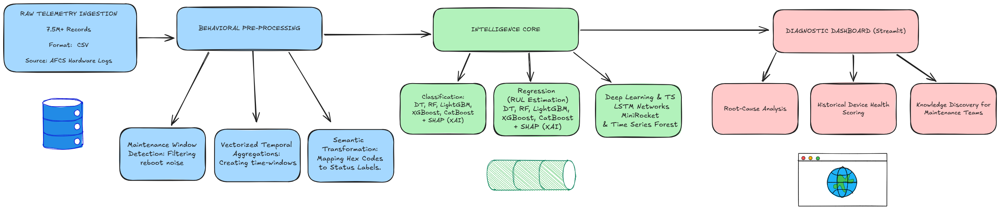

# Predictive Maintenance for Automatic Fare Collection Systems (AFCS)
## Transitioning from Reactive to Predictive Diagnostics in Urban Mobility

##  Professional Disclaimer (NDA)
*To comply with Non-Disclosure Agreements (NDAs), the source code and proprietary industrial datasets are strictly confidential and are not included in this repository. This documentation serves as a professional case study showcasing the methodology, architecture, and analytical workflow developed during my tenure.*

---

##  The "Behavioral" Angle: From Neurons to Machines
> **Author's Note:** My background in **Cognitive Neuroscience** allows me to treat machine telemetry not as static numbers, but as **dynamic behavioral signals**. Just as neural spikes describe brain activity, these gateway logs describe the "health state" of urban infrastructure. I apply a rigorous experimental mindset to data cleaning, hypothesis testing, and pattern recognition—treating every sensor log as a "behavioral profile" of the system.

---

##  Project Overview
This project, developed as a feasibility study for **Automatic Fare Collection Systems (AFCS)**, focuses on transitioning metro validation gates from a "fail-and-fix" reactive model to a data-driven proactive strategy. 

### The Industrial Challenge:
- **Massive Scale:** Managed and processed a dataset of **7.5 Million telemetry logs**.
- **Noisy Environment:** High signal-to-noise ratio, inconsistent failure definitions, and asynchronous data sampling.
- **Data Gap:** Navigating a real-world scenario without dedicated IoT sensors (vibration/temperature), relying exclusively on standard hardware diagnostic logs.

---

##  System Architecture
The following diagram illustrates the end-to-end pipeline designed to transform raw logs into actionable maintenance insights:

1. **Ingestion:** High-performance querying of 7.5M records via **DuckDB**.
2. **Preprocessing:** Behavioral profiling through vectorized temporal aggregations, **Operational Stress Analysis** and **Maintenance Window/Reboot Detection**.
3. **Intelligence Layer:** Comparative analysis between Classical ML, Regression for RUL, and Deep Learning.
4. **Diagnostic UI:** Historical data exploration and knowledge discovery via a custom **Streamlit** dashboard.

---

##  Iterative Research Strategy (Zero-Refactor Policy)
The modeling strategy followed a chronological research path. To maintain the integrity of the experimental process, each stage uses specific preprocessing tailored to the architectural attempt:

### Phase 1: Data Discovery & Cleaning
- **Big Data Handling:** Managed 7.5M records, identifying critical peak-hour patterns and "high-stress days" correlating with system fatigue.
- **Maintenance Window Identification:** Identified massive nocturnal telemetry spikes as scheduled system reboots (3-5 AM) rather than operational failures. This was a key step in filtering "system noise" to prevent false positives.
- **Semantic Decoding:** Re-mapped cryptic hardware hex codes into standardized technical labels for better interpretability.

### Phase 2: Classification Benchmarking 
- Established baseline performance using **Decision Tree, Random Forest, LightGBM, XGBoost and CatBoost**.
- **Explainability (XAI):** Applied **SHAP** values to interpret feature importance and understand the biological "triggers" of system failures.

### Phase 3: Regression Analysis
- Developed regression models using **Decision Tree, Random Forest, LightGBM, XGBoost and CatBoost** to estimate the **Remaining Useful Life (RUL)**.
- Used **SHAP** to analyze the impact of chronological variables and usage frequency on system degradation.

### Phase 4: Deep Learning & Time-Series
- Developed **LSTM (Long Short-Term Memory)** networks to capture deep temporal dependencies in diagnostic sequences.
- Integrated **MiniRocket** and **Time Series Forest**for efficient time-series classification.
- *Note: This phase focused on maximizing predictive power through non-linear temporal patterns.*

### Phase 5: Historical Diagnostics Dashboard
- Built a multi-tab prototype using **Streamlit and Plotly** for **Knowledge Discovery** and **Historical Analysis**.
- Enabled stakeholders to perform "root-cause" diagnostics on historical data, identifying outlier devices and recurring error patterns.

---

## Key Achievements
- **Dual-Layer Pattern Recognition:** Isolated maintenance-induced log spikes (reboots) from genuine operational anomalies (stress peaks).
- **Advanced Feature Engineering:** Managed categorical variables and noisy logs using vectorized temporal aggregations.
- **Explainability (XAI):** Integrated **SHAP** values to ensure transparency for maintenance teams.
- **Interactive Diagnostics:** Built a prototype dashboard for historical KPI monitoring and knowledge discovery.
- **Bridging the Gap:** Effectively communicated complex AI results to non-technical stakeholders through interactive visualization.
- **Proactive Roadmap:** Provided a data-driven foundation for future IoT sensor integration.

---

##  Tech Stack
- **Data Engine:** `Python`, `Pandas`, `NumPy`, `DuckDB`, `PyArrow`
- **Machine Learning (XAI):** `Scikit-learn`, `sktime`, `MiniRocket`, `XGBoost`, `LightGBM`, `SHAP`
- **Deep Learning:** `TensorFlow/Keras (LSTM)`
- **Visualization:** `Streamlit`, `Plotly`, `Matplotlib`, `Seaborn`

---
*Disclaimer: This project was developed during my Master’s Thesis in Big Data Analytics and AI, in collaboration with a leading industrial partner.*
